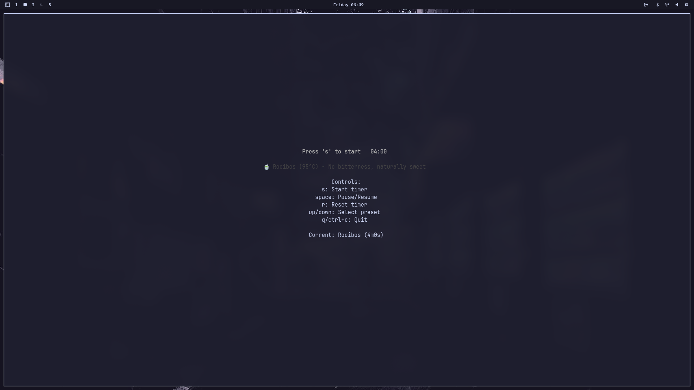
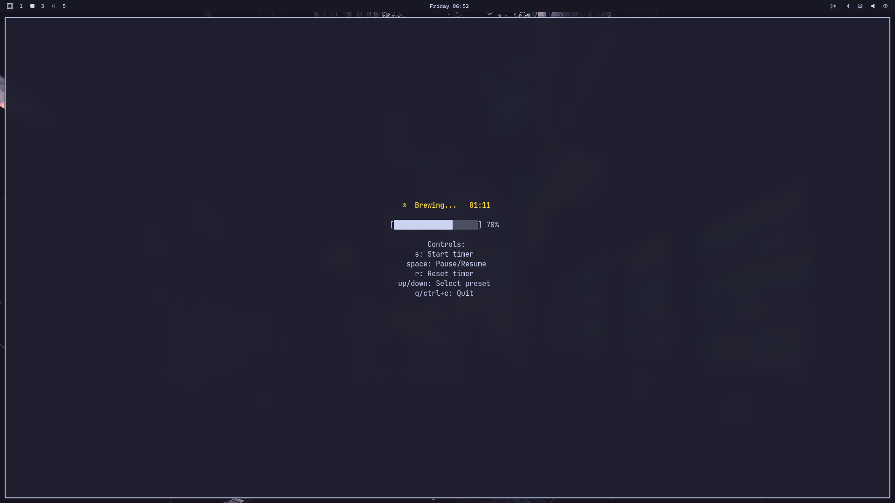
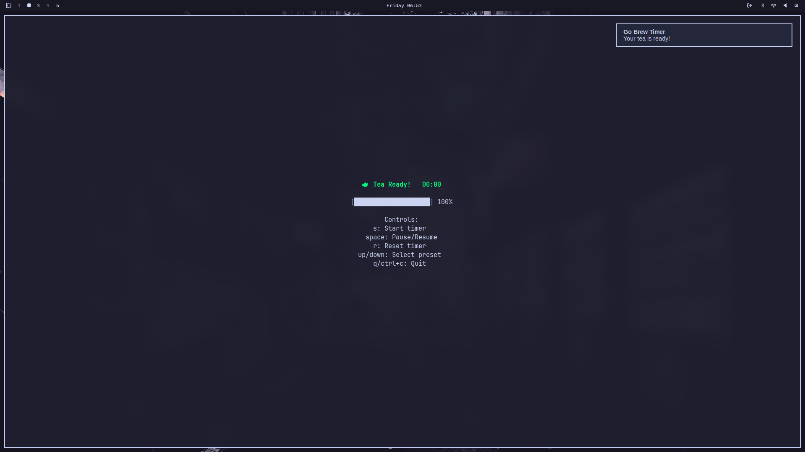

# Go Brew CLI

A professional CLI tea timer application built with Go and the Bubbletea TUI framework. Perfect timing for the perfect cup of tea.


## Features

- ⏰ **Precise Timing** - Accurate countdown timer with visual progress bar
- 🍵 **Tea Presets** - Built-in presets for different tea types (Black, Green, Herbal, etc.)
- 🎵 **Audio Alerts** - Cross-platform audio notifications when tea is ready
- 🔔 **Desktop Notifications** - System notifications for when tea is ready
- ⌨️ **Keyboard Controls** - Intuitive keyboard shortcuts for all operations
- 📱 **Responsive UI** - Adapts to terminal size with centered layout
- 🎨 **Beautiful Interface** - Color-coded states and progress indicators
- 🔧 **Configurable** - Customizable brew times and settings

## Quick Start

### Installation

#### Go Install (Recommended)
```bash
go install github.com/Spectari-code/go-brew@latest
```

#### Download Binary
Will implement releases at a future date.

#### Build from Source
```bash
git clone https://github.com/Spectari-code/go-brew.git
cd go-brew
go build -o go-brew .
```

### Basic Usage

```bash
# Run with default settings
go-brew

# Run with custom duration
go-brew -duration 2m

# Run with custom duration (3 minutes 30 seconds)
go-brew -duration 3m30s
```

## Controls

| Key | Action |
|-----|--------|
| `s` | Start timer |
| `space` | Pause/Resume timer |
| `r` | Reset timer |
| `↑`/`↓` | Select tea preset |
| `q` or `Ctrl+C` | Quit application |

## Tea Presets

Go Brew includes carefully crafted presets for different tea types:

| Tea Type | Duration | Temperature | Notes |
|----------|----------|-------------|-------|
| Rooibos | 4 minutes | 95°C | No bitterness, naturally sweet |
| Green Tea | 2 minutes | 80°C | Don't overbrew to avoid bitterness |
| Black Tea | 3 minutes | 95°C | Full flavor development |
| Herbal | 5 minutes | 95°C | Medicinal properties develop over time |
| White Tea | 2 minutes | 75°C | Delicate flavor, careful timing |
| Oolong | 3 minutes | 85°C | Complex flavors, multiple infusions possible |

## Screenshots

### 🍵 Idle State
*Application startup showing tea selection and ready to brew*



### ⏰ Brewing in Progress
*Timer counting down with visual progress bar during brew cycle*



### ✅ Tea Ready
*Brewing complete with notification and timer finished state*



## Configuration

### Command Line Options

```bash
go-brew [flags]

Flags:
  -duration duration
        Brew time for the tea timer (default 4m)
```

### Environment Variables

No environment variables are currently supported, but you can customize the experience by:

1. **Custom Tea Presets**: Modify `DefaultTeaPresets` in `config.go`
2. **Audio Settings**: Toggle sound and notification options
3. **Key Bindings**: Customize keyboard shortcuts in the configuration

## Development

### Prerequisites

- Go 1.23 or later
- Git

### Development Setup

```bash
# Clone the repository
git clone https://github.com/Spectari-code/go-brew.git
cd go-brew

# Install dependencies
go mod tidy

# Run in development mode
go run .

# Run with custom duration
go run . -duration 2m
```

### Building

```bash
# Build for current platform
go build -o go-brew .

# Build for all platforms (requires GoReleaser)
goreleaser build --snapshot

# Build release version
goreleaser build --clean
```

### Testing

```bash
# Run all tests
go test

# Run tests with verbose output
go test -v

# Run tests with coverage
go test -cover

# Run specific test
go test -run TestInitialModel
```

## Architecture

Go Brew follows the **Model-View-Update (MVU)** architecture pattern from the Bubbletea framework:

- **Model** (`model.go`): Application state and data
- **View** (`view.go`): UI rendering and display logic
- **Update** (`update.go`): Event handling and state transitions
- **Config** (`config.go`): Configuration management and presets
- **Audio** (`audio.go`): Cross-platform audio playback

### Key Dependencies

- [Bubbletea](https://github.com/charmbracelet/bubbletea) - TUI framework
- [Lipgloss](https://github.com/charmbracelet/lipgloss) - Terminal styling
- [beeep](https://github.com/gen2brain/beeep) - Desktop notifications
- [go-mp3](https://github.com/hajimehoshi/go-mp3) + [oto](https://github.com/hajimehoshi/oto) - Audio playback

## Contributing

We welcome contributions! Please read our [CONTRIBUTING.md](CONTRIBUTING.md) for guidelines on:

- Code style and standards
- Testing requirements
- Pull request process
- Development setup

### Quick Contribution Guide

1. Fork the repository
2. Create a feature branch (`git checkout -b feature/amazing-feature`)
3. Make your changes
4. Add tests for new functionality
5. Ensure all tests pass (`go test`)
6. Commit your changes (`git commit -m 'Add amazing feature'`)
7. Push to the branch (`git push origin feature/amazing-feature`)
8. Open a Pull Request

## Troubleshooting

### Audio Not Working

Go Brew includes multiple fallback mechanisms for audio:

1. **Primary**: MP3 playback using `alert.mp3`
2. **Fallback 1**: System sound files
3. **Fallback 2**: Terminal bell character

If audio isn't working, ensure:
- `alert.mp3` exists in the same directory as the binary
- Your system has audio capabilities
- Try running in a terminal that supports audio

### Terminal Compatibility

Go Brew works in most modern terminals:
- Terminal.app (macOS)
- iTerm2 (macOS)
- Windows Terminal
- GNOME Terminal (Linux)
- Konsole (Linux)

For best results, use a terminal that supports:
- ANSI colors
- Unicode characters (for progress bar)
- Alternative screen mode

## Performance

- **Memory Usage**: ~2-5MB RAM during operation
- **CPU Usage**: <1% during normal operation
- **Binary Size**: ~3-5MB (depending on platform)

## License

This project is licensed under the MIT License - see the [LICENSE](LICENSE) file for details.

## Acknowledgments

- [Charm Bubbletea](https://github.com/charmbracelet/bubbletea) - Excellent TUI framework
- [Charm Lipgloss](https://github.com/charmbracelet/lipgloss) - Beautiful terminal styling
- Tea enthusiasts who provided timing recommendations

## Related Projects

- [gum](https://github.com/charmbracelet/gum) - TUI tool for shell scripts
- [glow](https://github.com/charmbracelet/glow) - Markdown renderer for TUI
- [lazygit](https://github.com/jesseduffield/lazygit) - Git TUI

---

**Made with ☕ and ❤️ by [Spectari-code](https://github.com/Spectari-code)**

If you find this tool useful, consider giving it a ⭐ on GitHub!
